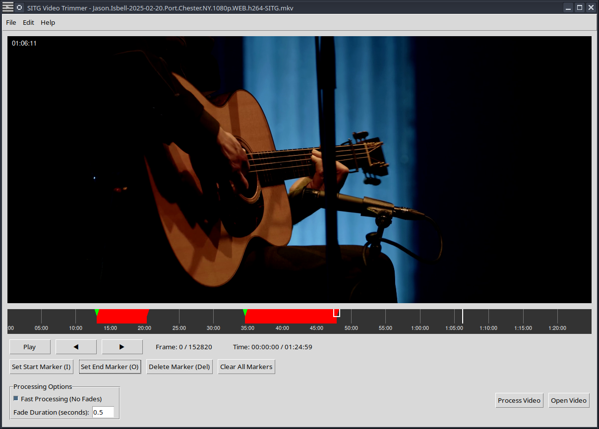

# SITG Video Trimmer

A cross-platform application for trimming video files without re-encoding.



## Overview

SITG Video Trimmer allows users to easily remove unwanted segments from video files (MKV, MP4, TS) without re-encoding. The application features a graphical user interface built with Tkinter and utilizes FFmpeg for video processing.

This version features a modular architecture for improved maintainability and extensibility.

## Features

- Load and display video files (MKV, MP4, TS formats)
- Visual timeline representation of the video's duration
- Display still frames at the current timeline position
- Set start and end points to mark segments for removal
- Multiple segment marking capabilities
- Improved marker management with drag-and-drop functionality
- Enhanced keyboard shortcuts for efficient editing
- Fade in/out transitions at segment boundaries
- Two processing modes: Fast (no re-encoding) and Quality (with re-encoding)
- Cancellable processing with progress feedback
- Cross-platform compatibility (Windows, macOS, and Linux)
- Modular architecture for better code organization and maintainability

## Requirements

- Python 3.6 or higher
- FFmpeg
- Tkinter (usually included with Python)
- OpenCV (cv2)
- Pillow (PIL)
- NumPy

## Installation

### Windows

1. Install Python 3.6 or higher from [python.org](https://www.python.org/downloads/)
   - Make sure to check "Add Python to PATH" during installation
2. Install FFmpeg:
   - Download from [ffmpeg.org](https://ffmpeg.org/download.html)
   - Extract to a folder (e.g., C:\ffmpeg)
   - Add the bin folder to your PATH environment variable (e.g., C:\ffmpeg\bin)
3. Run the installation script:
   ```
   install_windows.bat
   ```

### Ubuntu/Debian Linux

1. Install Python, pip, and required system dependencies:
   ```
   sudo apt update
   sudo apt install python3 python3-pip python3-tk ffmpeg
   ```
2. Run the installation script:
   ```
   chmod +x install_linux.sh
   ./install_linux.sh
   ```
   
   This will:
   - Install all required Python dependencies
   - Create a launcher script to run the application

3. To run the application after installation:
   ```
   ./run_sitg_trimmer.sh
   ```

### macOS

1. Install Python 3.6 or higher from [python.org](https://www.python.org/downloads/)
2. Install FFmpeg using Homebrew:
   ```
   brew install ffmpeg
   ```
3. Run the installation script:
   ```
   chmod +x install_macos.sh
   ./install_macos.sh
   ```
   
   This will:
   - Install all required Python dependencies
   - Create a launcher script to run the application

4. To run the application after installation:
   ```
   ./run_sitg_trimmer.command
   ```
   
   Note: On macOS, you may need to right-click the `run_sitg_trimmer.command` file and select 'Open' the first time you run it.

## Usage

1. Start the application:
   - Windows: `run_sitg_trimmer.bat`
   - Linux: `./run_sitg_trimmer.sh`
   - macOS: `./run_sitg_trimmer.command`

2. Open a video file using the "Open Video" button or File menu (Ctrl+O).

3. Mark segments to remove:
   - Press 'I' or click "Set Start Marker" to mark the start of a segment
   - Press 'O' or click "Set End Marker" to mark the end of a segment
   - Segments are automatically created when both start and end markers are set
   - Repeat to mark multiple segments

4. You can drag markers on the timeline to adjust their positions.

5. Set the fade duration for smooth transitions.

6. Choose a processing mode:
   - Fast Mode: Quickly processes video without re-encoding (better for speed)
   - Quality Mode: Re-encodes video with transitions (better for quality)

7. Click "Process Video" (Ctrl+P) to remove the marked segments and save the result.

8. You can cancel processing at any time by clicking the "Cancel" button in the progress window.

## Keyboard Shortcuts

- Ctrl+O: Open video file
- Ctrl+P: Process video
- Space: Toggle video playback
- Left/Right arrows: Navigate one frame backward/forward
- I: Set start marker
- O: Set end marker
- Delete: Delete selected marker
- Tab: Select next marker
- Shift+Tab: Select previous marker
- F1: Show help

## Modular Architecture

The application is organized into separate modules with clear responsibilities:

- `src/video_player.py`: Handles video loading, playback, and frame extraction
- `src/timeline.py`: Manages the timeline visualization, markers, and segments
- `src/ffmpeg_handler.py`: Handles FFmpeg operations for video processing
- `src/app.py`: Main application controller that integrates all components
- `src/main.py`: Entry point that initializes the application

## Customization

You can modify the application to suit your needs by editing the Python source code. The modular architecture makes it easy to extend or modify specific components without affecting the rest of the application.

## Contributing

Contributions are welcome! Please feel free to submit a Pull Request.
